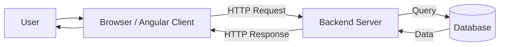
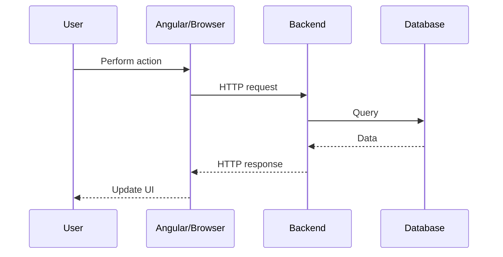
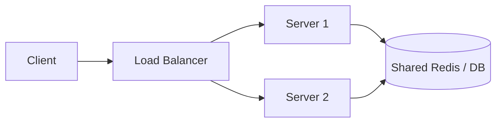

# 01 — Client–Server Architecture

## What is it?
A **client** requests a service and a **server** processes the request and returns a response.



## Key concepts
- **Client:** Browser, Angular app, mobile app, etc.
- **Server:** Runs application/business logic and handles requests.
- **Database:** Stores persistent data.
- **API:** Interface through which clients communicate with backend services.

## Typical flow



## Why not connect Angular directly to the database?

```text
❌ Angular → Database
✅ Angular → Backend API → Database
```

The backend handles authentication, authorization, validation, business logic, transactions, security, and controlled database access.

## Statelessness

A stateless application server does not depend on state stored only in its own memory.



## Interview takeaway
A client sends a request to a server. The server processes it, may communicate with databases or other services, and returns a response.
