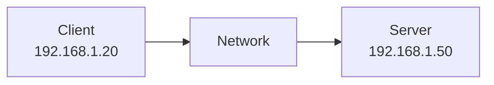
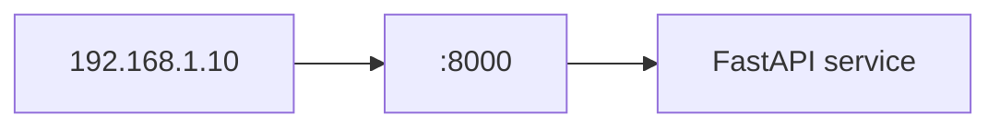

# 02 — IP Address

## What is an IP address?
An **IP address** is a numerical address assigned to a network interface that identifies a device/interface on a network.



Think:

```text
IP address → Which machine/network interface?
Port       → Which service?
```

## IPv4
IPv4 uses **32 bits**, commonly written as:

```text
192.168.1.10
```

## IPv6
IPv6 uses **128 bits**.

```text
IPv4 → 32-bit
IPv6 → 128-bit
```

## Private vs public IP
Common private IPv4 ranges include:

```text
10.0.0.0/8
172.16.0.0/12
192.168.0.0/16
```

Private IPs are used inside private networks. Public IPs are routable on the public internet.

## IP and port



An IP address does **not** identify a process. A process can listen on a port associated with a network interface.

## Interview takeaway
> IP identifies the network endpoint/interface; a port identifies the network service endpoint on that host.
