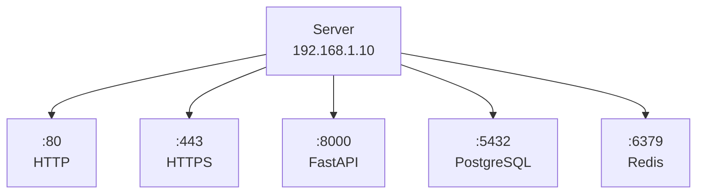
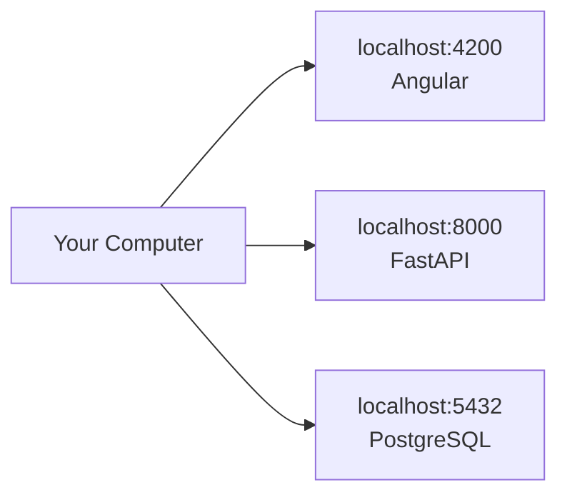

# 03 — Ports

## What is a port?
A **port** is a logical communication endpoint used to identify a network service/application on a host.

```text
IP Address = Which machine/interface?
Port       = Which service?
```

## One server, multiple services



Each service can listen on a different port. A **process listens on a port**; the port is not the process itself.

## Common ports

| Port | Common usage |
|---:|---|
| 22 | SSH |
| 53 | DNS |
| 80 | HTTP |
| 443 | HTTPS |
| 3306 | MySQL |
| 5432 | PostgreSQL |
| 6379 | Redis |
| 8000 | Common development/API port |
| 8080 | Common web/application port |
| 9092 | Common Kafka port |

These are conventions/defaults; ports can be configured differently.

## Local development



## Localhost
`localhost` refers to the local machine. `127.0.0.1` is the commonly used IPv4 loopback address.

## HTTPS and 443
Port `443` is the standard/default port assigned to HTTPS.

```text
http://example.com   → commonly port 80
https://example.com  → commonly port 443
```

## Interview takeaway

```text
IP → machine/interface
Port → service endpoint
Process → program listening on a port
```
