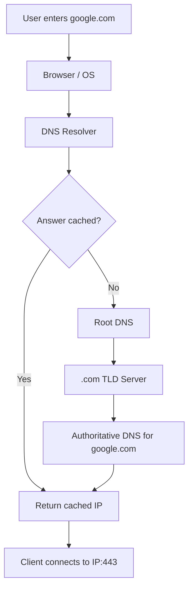
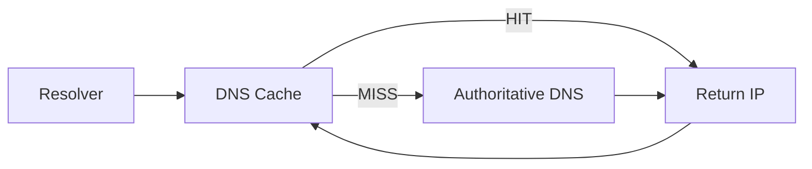
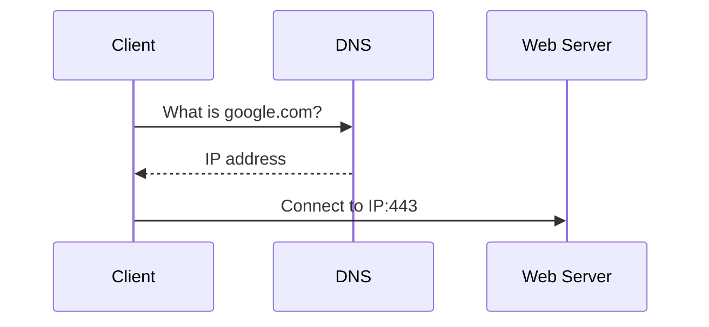

# 04 — DNS (Domain Name System)

## What is DNS?
DNS is a distributed naming system that translates domain names into IP addresses.

```text
google.com
    ↓
   DNS
    ↓
IP address
```

## DNS lookup



## Root, TLD and authoritative DNS

```text
Root DNS
   ↓
.com TLD
   ↓
Authoritative DNS for google.com
   ↓
DNS record / IP address
```

The root directs the resolver toward the appropriate TLD infrastructure. The TLD directs it toward authoritative DNS servers.

## Cache and TTL
Resolvers can cache DNS answers. **TTL (Time To Live)** indicates how long a DNS result can generally be cached before refreshing.



## Important records

| Record | Purpose |
|---|---|
| A | IPv4 address |
| AAAA | IPv6 address |
| CNAME | Alias to another domain name |

## DNS does not call the web server
DNS answers:

> What IP address belongs to this domain?

Then the client uses that IP to establish the actual connection.



## Interview takeaway

```text
Domain → DNS → IP → Port → Service
```
