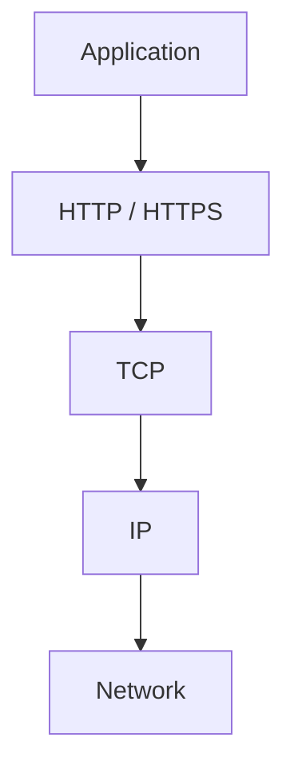
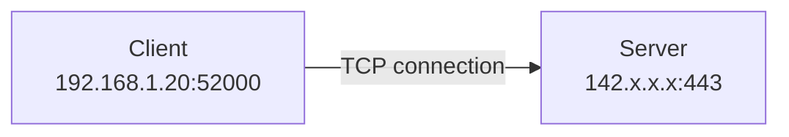
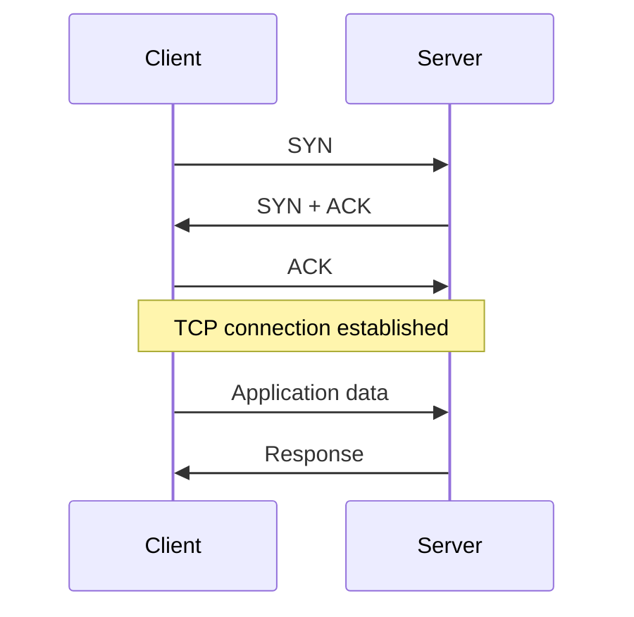
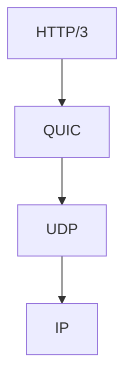
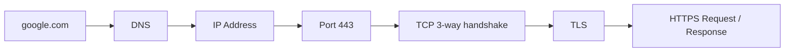

# 05 — TCP (Transmission Control Protocol)

## What is TCP?
TCP is a **connection-oriented transport-layer protocol** that provides reliable, ordered, and error-checked delivery between TCP endpoints.

## Why TCP?
IP networking alone does not provide application-level guarantees that data arrives reliably and in order.

TCP provides mechanisms such as:
- Sequence numbers
- Acknowledgments
- Retransmission
- Ordering
- Flow control
- Congestion control
- Checksums for error detection

## Where TCP fits

## TCP uses IP + ports

The client commonly uses an ephemeral source port.

## TCP 3-way handshake

### Steps
1. **SYN:** Client requests a TCP connection.
2. **SYN-ACK:** Server acknowledges and responds.
3. **ACK:** Client acknowledges the server.

## TCP vs UDP

| TCP | UDP |
|---|---|
| Connection-oriented | Connectionless |
| Reliable delivery mechanisms | No built-in delivery guarantee |
| Ordered byte stream | No built-in ordering |
| Retransmission | No built-in retransmission |
| Flow control | No TCP-style flow control |
| Congestion control | No TCP-style congestion control |

## HTTP/3 exception

HTTP/1.1 and HTTP/2 commonly use TCP; HTTP/3 uses QUIC over UDP.

## Complete web flow so far

## Important precision
TCP provides reliable transport mechanisms between TCP endpoints. It does **not** guarantee that the application's business operation succeeded.

## Interview takeaway
Know why TCP exists, the 3-way handshake, TCP vs UDP, and where TCP sits in the network stack.
